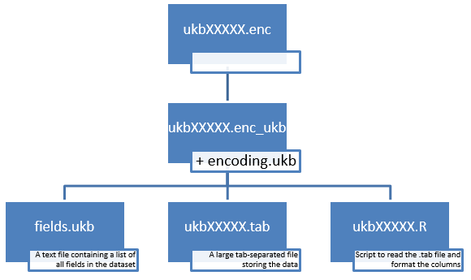

# Setting up the database

You will need the scripts in the [database](https://github.com/2cjenn/UKB_database/tree/main/database) folder.

## How to use

Follow the steps in Section 2.2 (Downloading, validating & decrypting a main dataset) in the [Accessing UK Biobank Data](https://biobank.ndph.ox.ac.uk/~bbdatan/Data_Access_Guide_v3.0.pdf) guide.

At this point you should have a directory containing:
* the `ukbconv` utility [Windows](https://biobank.ndph.ox.ac.uk/showcase/download.cgi)/[Linux](https://biobank.ndph.ox.ac.uk/showcase/download.cgi?id=201&ty=ut) 
* ukbXXXXX.enc_ukb - the file generated from Step 2.2.5 using `ukbunpack`

* Use ukbconv as per Section 2.3 (Converting a main dataset to your preferred format) of the [Accessing UK Biobank Data](https://biobank.ndph.ox.ac.uk/~bbdatan/Data_Access_Guide_v3.0.pdf) guide to generate
  * The .R and .tab files, using the `r` option
  * The .html documentation file, using the `docs` option
* Open a terminal window and run the following command, replacing `ukbXXXXX` with the name of your data file
  * `split -l 25000 -d --additional-suffix=.tab ukbXXXXX.tab ukbXXXXX_`
    * `-l` specifies how many lines per file (25k lines will split it into 21 files)
    * `-d` specifies numeric suffixes
    * `--additional suffix` lets us specify that we want the files to have extension ".tab""
* Run `ukb_db()`, passing in
  * The path to the extracted files.
  * The file stem  “ukbXXXX” where XXXX is the UKB run ID from the name of the files
  * The name of the database you want to write to (default is "ukb_data.db")
* This will read the .tab data-files and write them into the database. 
  * It does this one file at a time and prints out a progress indicator
  * It applies the .R script auto-generated by ukbconv to each chunk, so the variables in the database will already have had that basic formatting (eg labelling factor levels) applied
  
## Optional Extras

### Stata

If you want to access data from the database using Stata, you will additionally need to generate the .do and .dct from the download using ukbconv.

This might make the whole database system seem superfluous - but the benefit is: if your data download is too large for ukbconv to convert it to a stata .dta file in one go, it doesn't matter. Just grab the .do and .dct files, and  

### Mapping variable names
  
When running `ukb_db()` you can also pass in the path to a mapping sheet giving human-readable names to the UKB variables. This will produce a csv file containing all un-named variables and their descriptions, so you can add them to your mapping sheet.

The variables are saved in the database with the raw UKB variable names (eg f.52.0.0). When you extract the data, you can supply a mapping sheet (the default is our standard renaming spreadsheet Renaming_List_UPDATE_Sep2020_TEU.csv) and the selected names will be applied to the extracted data.

By using the raw names in the database we can be more flexible with our choice of renaming - if we want to change one of the variable name in the spreadsheet, or convert to an entirely new naming system, we don’t have to regenerate the database.

# Cautionary Note

The R package `duckdb` is still under development, which means that unfortunately new versions of the package are often not backwards compatible. This means a database written under one version of duckdb cannot be read by a later version.

Please consider using some form of package management, for example [`renv`](https://rstudio.github.io/renv/articles/renv.html) to facilitate control over package versions.

