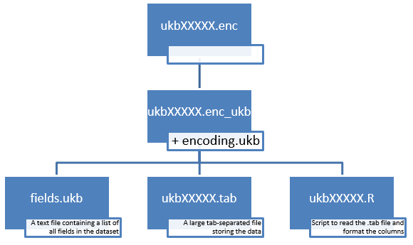

# DuckDB Database system for storing and extracting UKB data

#### Jennifer Collister, Xiaonan Liu
#### Translational Epidemiology Unit, NDPH

## Pre-requisites

* Access to a UK Biobank application
* A dataset downloaded from UK Biobank (see [Accessing UK Biobank Data](https://biobank.ctsu.ox.ac.uk/~bbdatan/Accessing_UKB_data_v2.3.pdf))

## Set-up

You will need [R](https://www.r-project.org/) installed.

I recommend cloning this repository onto your computer and using [`renv`](https://rstudio.github.io/renv/articles/renv.html) to install the required packages as specified in the project [lock file](https://github.com/2cjenn/UKB_database/blob/main/renv.lock).

Alternatively, you can install the necessary packages manually.

If you want to extract data into Stata, you will also need to install 

# Cautionary Note

The database system [`duckdb`](https://duckdb.org/) is still under development, which means that unfortunately new versions are often not backwards compatible. This means a database written under one version of duckdb cannot be read by a later version.

Please consider using some form of package management, for example [`renv`](https://rstudio.github.io/renv/articles/renv.html) to facilitate control over package versions.

